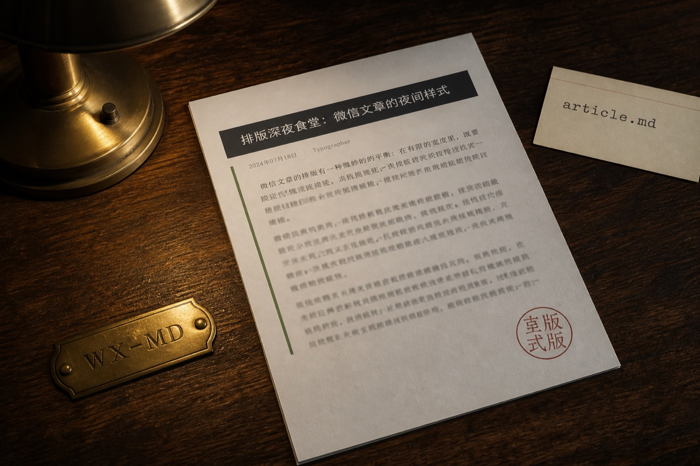
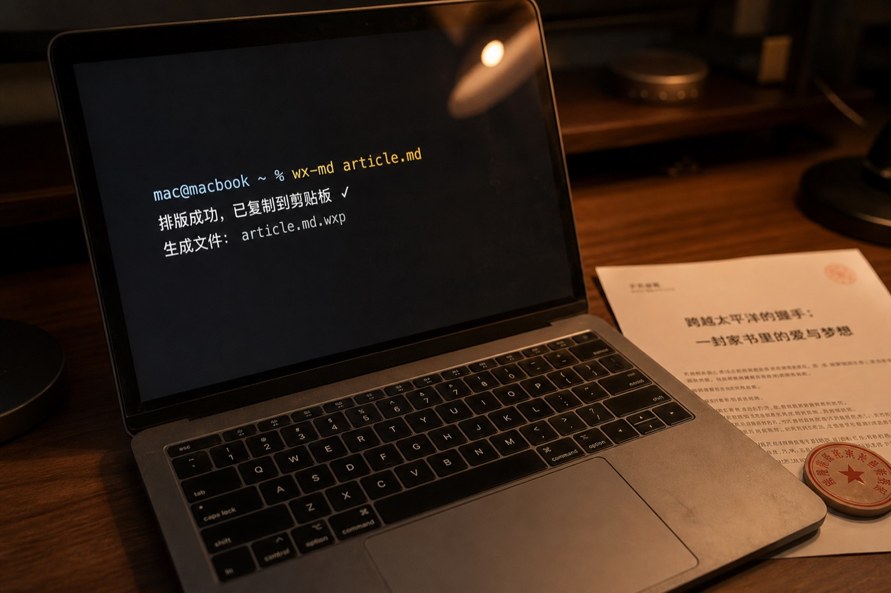
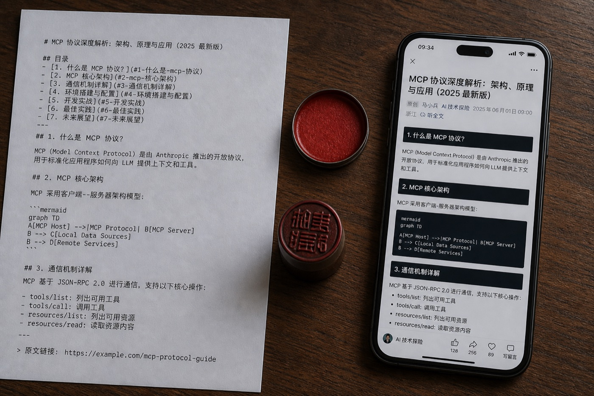
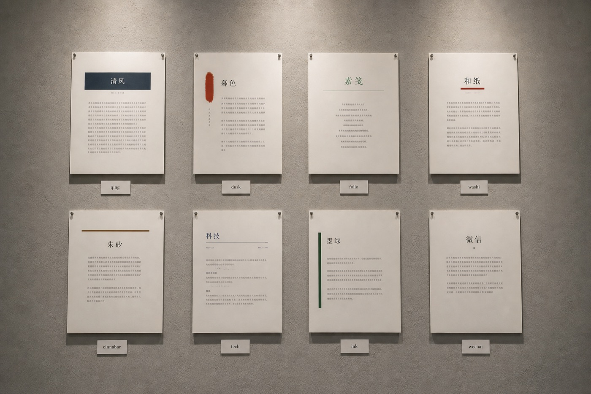

# 用一行命令，把 Markdown 发到微信公众号



写完一篇技术笔记，最烦的往往不是改措辞。

是把标题、引用、代码块，在公众号编辑器里重新点一遍。粘贴进去的 Markdown 只剩下一摊灰字：二级标题没有层次，代码没有颜色，链接横在句子中间，像说明书里没删干净的网址。

`wx-md` 是一条命令行。它在本地把 Markdown 收成公众号还能认得的 HTML，复制到剪贴板。你打开后台，粘贴，发。



## 公众号为什么吃不进普通 HTML

公众号编辑器几乎不认外部 CSS。类名、`<style>`、Flex，粘贴进去后经常被剥光。所以转换时不能只「把 md 变成 html」，还得把颜色、字号、间距写成每一个标签上的 `style`。

`wx-md` 做的就是这件事：解析 Markdown，按主题排好，再收成内联样式。复制时带的是 `text/html`，不是纯文本，颜色才能一起进编辑器。

## 安装

包名是 `@yanglingfeng/wx-markdown`，命令是 `wx-md` 或 `wx-markdown`。需要 Node.js 18 或更高版本。

```bash
npm i -g @yanglingfeng/wx-markdown
```

装好后任意目录都能用。

## 三十秒发一篇

```bash
wx-md article.md
```

默认会：

1. 在同目录生成 `article.html`
2. 把正文复制到剪贴板
3. 不打开浏览器

然后去微信公众号后台粘贴。想先看手机框里的校样，加上 `--open`。



文首也可以写一点元信息：

```md
---
title: 文章标题
theme: tech
---
```

## 主题不是换一套绿

内置八套，从常见公众号绿条，到深色代码、青瓷、暮色、折页、和纸、朱砂。技术文用 `tech`，随笔用 `ink`，想一次看完：

```bash
wx-md article.md -t tech
wx-md gallery
```



| 命令 | 气质 |
| --- | --- |
| `-t wechat` | 青葱，绿条，常见公众号 |
| `-t tech` | 终端，深色代码 |
| `-t qing` | 青瓷，冷青居中 |
| `-t dusk` | 暮色，酒红短线 |
| `-t folio` | 折页，铜线压栏 |
| `-t washi` | 和纸，靛蓝信笺 |
| `-t cinnabar` | 朱砂，宽印在侧 |
| `-t ink` | 墨韵，标题居中 |

自己的颜色可以垫在某一套上面：

```bash
wx-md init-theme ocean --from tech
wx-md article.md -t ocean
```

```json
{
  "extends": "tech",
  "tokens": {
    "accent": "#3d8bfd",
    "heading": "#1c2128"
  }
}
```

## 链接放到文末

公众号正文里跳出一串 URL，读起来像在修网页。`tech`、`qing` 这些主题默认把链接收成角标，集中到文末，同一网址只编一个号。

```bash
wx-md article.md --links-at-end
```

正文里的 `[说明文档](https://commonmark.org/)` 会变成「说明文档[1]」，文末出现「参考链接」。

## 图片还是要你自己传

本地图片预览能看，粘贴进公众号后不会跟着走。请先换成图床，或在编辑器里重新上传。这篇文章的配图也是一样：先插进稿子，发布前在后台传一遍。

封面可以用文首那张发稿台的照片。

## 常用命令

```bash
wx-md article.md -t qing
wx-md gallery
wx-md themes
wx-md article.md --stdout > body.html
wx-md -h
```

项目在 npm：<https://www.npmjs.com/package/@yanglingfeng/wx-markdown>

写完 md，就该发了。不必再为编辑器点一遍标题。
